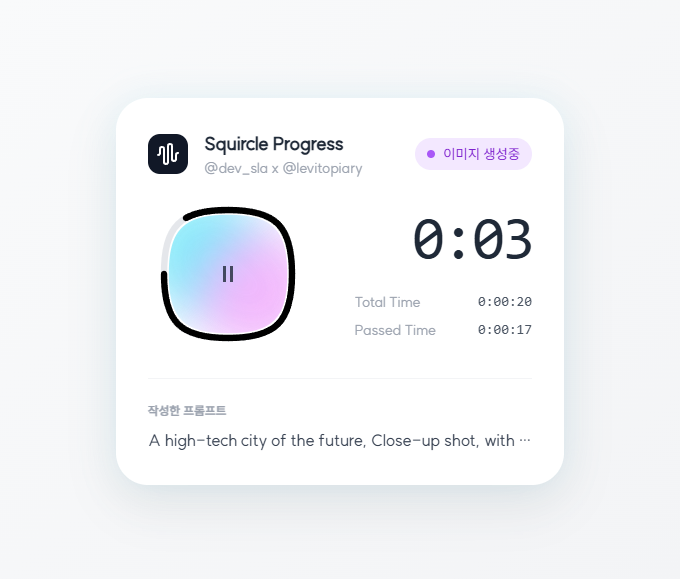

# Squircle Progress Card

AI 이미지 생성 진행 상황을 보여주는 Squircle(사각원) 형태의 프로그레스 카드 UI 컴포넌트입니다.

## 영감

이 프로젝트는 [@levitopiary](https://www.threads.com/@levitopiary)님의 [쓰레드 포스트](https://www.threads.com/@levitopiary/post/DNnIi3HJ096?xmt=AQF0trdBHPj_U0reuwDLdugPSK3VdxTMHZ4As4Q1f0kopA)에서 영감을 받아 제작되었습니다.

## 스크린샷



## 특징

- 🟦 **Squircle 디자인**: 부드러운 곡선의 사각원 형태 프로그레스 바
- ⏱️ **실시간 타이머**: 진행 시간을 실시간으로 표시
- 🎨 **그라디언트 효과**: 아름다운 그라디언트 색상 전환
- ✨ **애니메이션**: Framer Motion을 활용한 부드러운 애니메이션

## 기술 스택

- React 19
- TypeScript
- Tailwind CSS
- Framer Motion
- Vite

## 설치 및 실행

```bash
# 의존성 설치
npm install

# 실행
npm run dev

```

## 주요 컴포넌트

### SquircleProgress
Squircle 형태의 프로그레스 바를 구현한 핵심 컴포넌트입니다. SVG와 CSS를 활용하여 부드러운 곡선과 그라디언트 효과를 표현합니다.

### useTimer Hook
진행 시간을 추적하고 포맷팅하는 커스텀 훅입니다. 분:초 형식으로 시간을 표시합니다.

## 라이선스

MIT